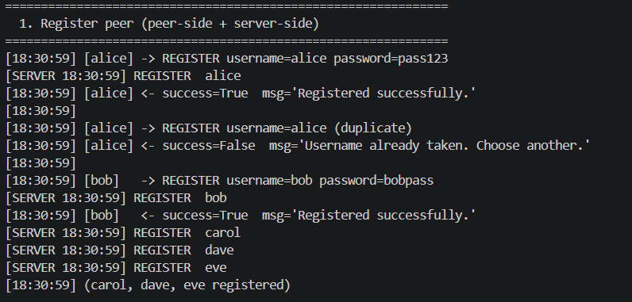
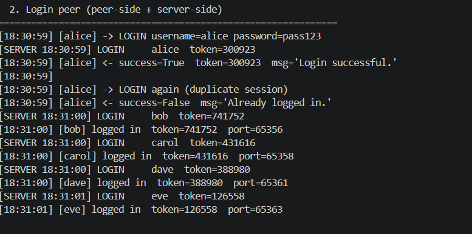
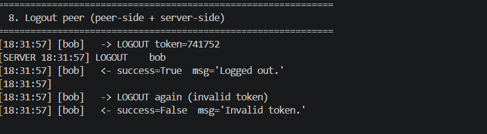
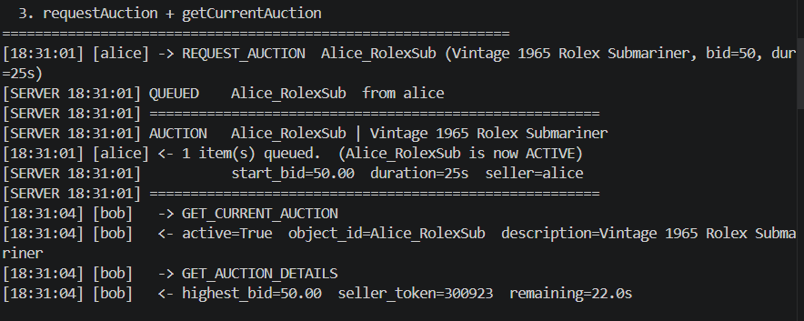
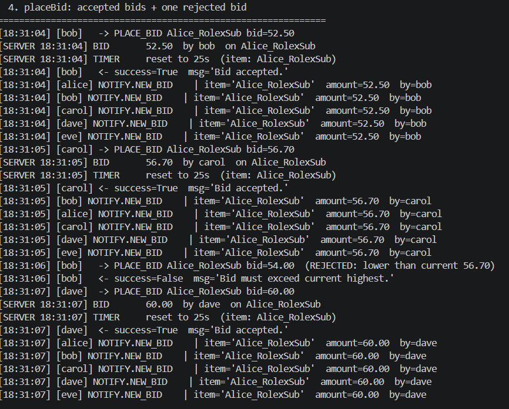
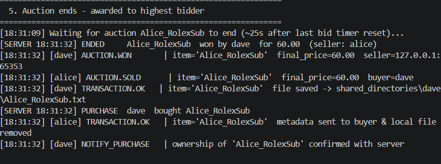
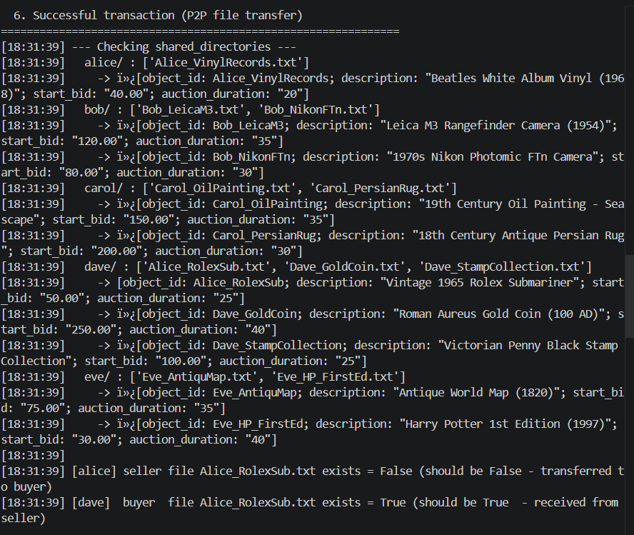
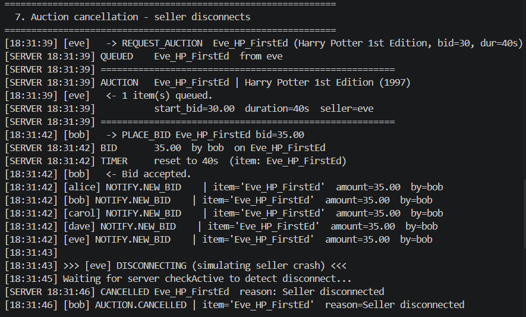
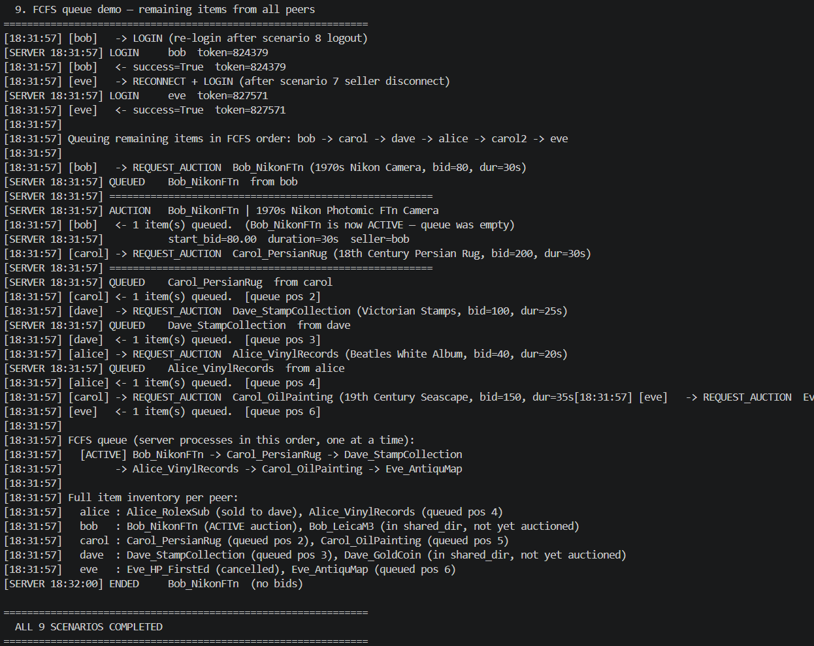

# Αναφορα Εργασιας - Κατανεμημενο Συστημα Δημοπρασιων (Φαση 1)

**Μαθημα:** Δικτυα Υπολογιστων - Εαρινο Εξαμηνο 2025-2026  
**Γλωσσα υλοποιησης:** Python  

---

## 1. Συντομη Αναλυση της Υλοποιησης

Η υλοποιηση ειναι ενα μικρο online συστημα δημοπρασιων πανω σε TCP sockets.
Υπαρχει ενας κεντρικος **Auction Server** και πεντε **Peers/Bidders**
(alice, bob, carol, dave, eve).

Κάθε peer μπορει:
- να βαλει αντικειμενο για πωληση,
- να δει τα bids που τρέχουν,
- να κανει bid,
- να λαβει ειδοποιησεις σε πραγματικο χρονο,
- σε περιπτωση που κερδισει την δημοπρασια, να παραλαβει το αρχειο του αντικειμενου με P2P μεταφορα.

### Αρχιτεκτονικη

- **Peer -> Server**: Request-response μεσω TCP. Ο peer ανοιγει συνδεση,
  στελνει αιτημα (register, login, bid κλπ.), παιρνει απαντηση και κλεινει
  τη συνδεση.
- **Server -> Peer**: Push notifications μεσω του ServerSocket καθε peer
  (νεα bids, ληξη δημοπρασιας, ακυρωση, check_active).
- **Peer -> Peer**: P2P transaction μεσω του ServerSocket του πωλητη
  (μεταφορα αρχειου metadata μετα την κατοχυρωση ενος item).

### Πρωτοκολλο Επικοινωνιας

Ολα τα μηνυματα ακολουθουν τη μορφη: **4 bytes (big-endian) μηκος + JSON
payload σε UTF-8**. Αυτο εξασφαλιζει αξιοπιστη ανταλλαγη μηνυματων μεταβλητου
μεγεθους πανω απο TCP.

### Concurrency

- Ο server χρησιμοποιει **threading** (ενα thread ανα συνδεση + ενα daemon
  thread για τη διαχειριση δημοπρασιων - auction manager loop).
- Ολες οι κοινοχρηστες δομες δεδομενων προστατευονται με **threading.Lock**
  για αποφυγη race conditions.
- Ο server διατηρει μετρητες `num_auctions_seller` και `num_auctions_bidder`
  για καθε χρηστη, ενημερωνοντας τους στη ληξη καθε δημοπρασιας.
- Καθε peer τρεχει 4 threads: main, peer_server, item_generator, auction_poller.

### FCFS Ουρα Δημοπρασιων

Ο Auction Server διατηρει `collections.deque` για τα αιτηματα δημοπρασιας.
Τα αντικειμενα εξυπηρετουνται με σειρα αφιξης (FCFS):
πρωτο μπηκε, πρωτο δημοπρατειται. Οταν τελειωσει μια δημοπρασια,
ξεκιναει αυτοματα η επομενη. Αν η ουρα ειναι αδεια,
ο auction manager thread αναμενει νεο αιτημα μεσω `threading.Event`.

### Timer Reset

Καθε φορα που γινεται αποδεκτο νεο bid, ο χρονος ληξης της δημοπρασιας
επαναφερεται: `end_time = time.time() + auction_duration`. Αυτο εξασφαλιζει
οτι μετα απο καθε νεο bid υπαρχει ξανα ολοκληρο χρονικο παραθυρο
για counteroffer.

---

## 2. Περιγραφη Αρχειων

Η δομη του κωδικα ακολουθει διαχωρισμο ευθυνων (separation of concerns),
ωστε καθε αρχειο να εχει διακριτο ρολο. Ακολουθει αναλυση ανα αρχειο.

### config.py

Το `config.py` συγκεντρωνει τις βασικες παραμετρους του συστηματος
(δικτυακες ρυθμισεις, χρονοδιαστηματα, πιθανοτητες συμπεριφορας). Η
συγκεντρωση αυτων των τιμων σε ενα σημειο βελτιωνει τη συντηρησιμοτητα,
γιατι οποιαδηποτε προσαρμογη σε timings ή πολιτικες bidding γινεται
χωρις να αλλαζει η επιχειρησιακη λογικη των υπολοιπων αρχειων.

### protocol.py

Το `protocol.py` οριζει τον ενιαιο μηχανισμο ανταλλαγης μηνυματων,
δηλαδη framing με μηκος + JSON payload. Με αυτον τον τροπο,
ο server και οι peers επικοινωνουν με συνεπη και ασφαλη τροπο,
αποφεγοντας ασυμβατοτητες στην αποκωδικοποιηση TCP ροων.

### auction_server.py

Το `auction_server.py` αποτελει τον πυρηνα του συστηματος. Εδω
υλοποιουνται η διαχειριση χρηστων/sessions, ο ελεγχος εγκυροτητας
αιτηματων, η FCFS ουρα δημοπρασιων, ο ελεγχος ενεργοτητας πωλητη
(`checkActive`), ο μηχανισμος timer reset μετα απο καθε αποδεκτο bid,
και οι ειδοποιησεις προς τους συμμετεχοντες. Με αλλα λογια,
συγκεντρωνει τη συνολικη λογικη συντονισμου της πλατφορμας.

### peer.py

Το `peer.py` υλοποιει τη συμπεριφορα του χρηστη-κομβου. Περιλαμβανει
τις λειτουργιες register/login/logout, polling για ενεργες δημοπρασιες,
υποβολη bids, ληψη ειδοποιησεων, αλλα και την P2P συναλλαγη μετα
την κατοχυρωση. Επιπλεον, εκκινει τα απαραιτητα βοηθητικα threads
ωστε ο peer να δρα ταυτοχρονα ως client και ως endpoint για εισερχομενα
μηνυματα/requests.

### run_demo.py

Το `run_demo.py` χρησιμοποιειται για γρηγορη επιδειξη του συστηματος
σε ολοκληρωμενο σεναριο λειτουργιας. Αυτοματοποιει την εκκινηση
server και πολλαπλων peers, ωστε να επιβεβαιωνεται ευκολα η βασικη
λειτουργικοτητα χωρις χειροκινητη διαχειριση πολλων τερματικων.

### test_scenarios.py

Το `test_scenarios.py` υλοποιει αναπαραγωγιμα, καθορισμενα σεναρια
ελεγχου που καλυπτουν τις κρισιμες απαιτησεις της εργασιας:
register/login/logout, bidding, ληξη δημοπρασιας, P2P μεταφορα,
ακυρωση δημοπρασιας και FCFS συμπεριφορα ουρας. Ετσι, λειτουργει
ως μεσο τεκμηριωμενης επαληθευσης της ορθοτητας του συστηματος.

### Σχεσεις μεταξυ αρχειων

- `config.py` και `protocol.py` ειναι shared modules που χρησιμοποιουνται
  απο ολα τα αλλα αρχεια.
- `auction_server.py` import-αρει config + protocol.
- `peer.py` import-αρει config + protocol.
- `run_demo.py` εκκινει auction_server.py και peer.py ως ξεχωριστα processes.
- `test_scenarios.py` import-αρει ολα τα modules σε ενα ενιαιο process.

### Περιεχομενα shared_directories

Καθε peer εχει αρχεια προ-φορτωμενα στον φακελο `shared_directories/<peer>/`:

| Peer | Αρχεια |
|------|--------|
| alice | Alice_RolexSub.txt, Alice_VinylRecords.txt |
| bob | Bob_NikonFTn.txt, Bob_LeicaM3.txt |
| carol | Carol_PersianRug.txt, Carol_OilPainting.txt |
| dave | Dave_StampCollection.txt, Dave_GoldCoin.txt |
| eve | Eve_HP_FirstEd.txt, Eve_AntiquMap.txt |

Καθε αρχειο εχει μορφη: `[object_id: ...; description: "..."; start_bid: "..."; auction_duration: "..."]`

### Μεταγλωττιση / Εκτελεση

Η Python ειναι interpreted γλωσσα - δεν απαιτειται μεταγλωττιση.
Δεν χρειαζονται εξωτερικα dependencies (μονο standard library),
οποτε το project τρεχει αμεσα.

---

## 3. Τεκμηριωση

### Τροπος Εκτελεσης

**Προτεινομενη προετοιμασια πριν απο καθε νεο run (PowerShell):**
```
# 1) Σταματα τυχον παλιες διεργασιες python
Get-Process python -ErrorAction SilentlyContinue | Stop-Process -Force

# 2) Καθαρισε τυχαια Object_* που μπορει να εμειναν απο προηγουμενο manual run
Get-ChildItem .\shared_directories -Recurse -Filter "Object_*.txt" | Remove-Item -Force
```
Η παραπανω προετοιμασια ειναι χρησιμη επειδη μετα απο συναλλαγες τα αντικειμενα
αλλαζουν ownership και μπορει να μεινουν σε διαφορετικο peer απο προηγουμενη εκτελεση.
Ετσι αποφευγονται ασυνεπειες σε επαναληπτικα manual tests.

**Αυτοματο demo (ολα μαζι):**
```
python run_demo.py
```
Αυτη ειναι η πιο ευκολη επιλογη. Εκκινει 1 server + 5 peers.
Με Ctrl+C σταματανε ολα.

**Χειροκινητη εκτελεση (ξεχωριστα terminals):**
```
Terminal 1:  .\\.venv\\Scripts\\python.exe auction_server.py
Terminal 2:  .\\.venv\\Scripts\\python.exe peer.py 1 alice pass123 --no-auto-items
Terminal 3:  .\\.venv\\Scripts\\python.exe peer.py 2 bob bobpass --no-auto-items
Terminal 4:  .\\.venv\\Scripts\\python.exe peer.py 3 carol carolpass --no-auto-items
Terminal 5:  .\\.venv\\Scripts\\python.exe peer.py 4 dave davepass --no-auto-items
Terminal 6:  .\\.venv\\Scripts\\python.exe peer.py 5 eve evepass --no-auto-items
```
Η χρηση του πληρους path προς το Python της virtual environment αποφευγει
προβληματα με το `Activate.ps1` στο PowerShell και εξασφαλιζει οτι ολες οι
διεργασιες τρεχουν στο ιδιο περιβαλλον.

Με αυτη τη διαταξη, καθε peer χρησιμοποιει τον αντιστοιχο φακελο
`shared_directories/alice`, `shared_directories/bob`, `shared_directories/carol`,
`shared_directories/dave`, `shared_directories/eve`, οποτε οι αλλαγες απο τις
πωλησεις/αγορες φαινονται αμεσα στους σωστους φακελους.

Η επιλογη `--no-auto-items` χρησιμοποιειται μονο για manual testing, ωστε να
μην παραγονται επιπλεον τυχαια αρχεια `Object_*` που δυσκολευουν τον ελεγχο.

**Ελεγχομενα σεναρια (αναπαραγωγη screenshots):**
```
python test_scenarios.py
```
Εκτελει σειριακα ολα τα σεναρια του report και παραγει την εξοδο των screenshots.
Το σεναριο ειναι deterministic και κανει εσωτερικο reset για το βασικο auction αντικειμενο,
αλλα η προετοιμασια που δινεται πιο πανω παραμενει προτεινομενη για καθαρο περιβαλλον.

### Ρυθμισεις (config.py)

Οι τρεχουσες τιμες συμφωνουν πληρως με τις προδιαγραφες:
- `AUCTION_POLL_INTERVAL = 60` (spec: 60s) — διαστημα polling peers
- `ITEM_GEN_MAX_INTERVAL = 120` (spec: 120s) — μεγιστο διαστημα παραγωγης αντικειμενου
- `CHECK_ACTIVE_INTERVAL = 5` — διαστημα ελεγχου liveness πωλητη
- `BID_INTEREST_PROBABILITY = 0.60` (60% πιθανοτητα ενδιαφεροντος)
- `BID_INCREMENT_FACTOR = 0.10` (NewBid = HighestBid * (1 + RAND/10))

### Αποκλισεις απο τις Προδιαγραφες

Δεν υπαρχουν αποκλισεις απο τις βασικες απαιτησεις της εκφωνησης.
Υπαρχουν δυο χρησιμες βελτιωσεις που κρατανε το συστημα πιο καθαρο σε demo:
- **Timer reset on bid**: ο χρονος ληξης ανανεωνεται σε καθε νεο bid
  (καλυτερο fairness, γιατι δινει χρονο για αντιπροσφορα)
- **Rejected bid demo**: το test_scenarios.py επιδεικνυει ρητα
  αποτυχη bid (bid < current highest), για να φαινεται καθαρα ο ελεγχος.

---

## 4. Screenshots Εξοδου

Ολα τα παρακατω παραχθηκαν απο την εκτελεση `python test_scenarios.py`.
Οι γραμμες με `[SERVER HH:MM:SS]` ειναι η πλευρα του Auction Server.
Οι γραμμες με `[HH:MM:SS] [peer_name]` ειναι η πλευρα του Peer.

### 4.1 Register peer στον Auction Server



**Peer-side:** Ο peer στελνει μηνυμα `REGISTER` με username+password.
Λαμβανει success/failure απαντηση. Σε duplicate username,
παιρνει καθαρο μηνυμα αποτυχιας.

**Server-side:** Ο server δημιουργει λογαριασμο με μετρητες
`num_auctions_seller=0` και `num_auctions_bidder=0`. Σε duplicate απαντα αρνητικα.

### 4.2 Login peer στον Auction Server



**Peer-side:** Ο peer στελνει `LOGIN`, λαμβανει τυχαιο `token_id`.
Αμεσως μετα εκκινει ServerSocket (port) και γνωστοποιει τα στοιχεια
επικοινωνιας στον server μεσω `requestAuction`.

**Server-side:** Ο server πιστοποιει τον peer, δημιουργει μοναδικο
τυχαιο `token_id` και αποθηκευει τα στοιχεια session (token, ip, port, username).

### 4.3 Logout peer απο τον Auction Server



**Peer-side:** Ο peer στελνει `LOGOUT` με `token_id`. Μετα την αποχωρηση
το token ειναι ακυρο (επομενο LOGOUT με ιδιο token αποτυγχανει).

**Server-side:** Ο server αφαιρει τη session, ακυρωνει το token_id και
αφαιρει τυχον αντικειμενα του peer απο την ουρα αναμονης.

### 4.4 Πληροφοριες για τρεχουσα δημοπρασια (requestAuction + getCurrentAuction)



**Peer-side:** Με `getCurrentAuction` ο peer μαθαινει ποιο αντικειμενο
δημοπρατειται τωρα. Με `getAuctionDetails` μαθαινει τρεχον highest bid,
token πωλητη και υπολοιπομενο χρονο.

**Server-side:** Ο server απαντα με τα στοιχεια της τρεχουσας δημοπρασιας
και ταυτοχρονα εκτελει `checkActive` για να επαληθευσει οτι ο πωλητης
ειναι ακομα συνδεδεμενος.

### 4.5 Επιτυχης προσφορα πλειοδοσιας (+ απορριφθεν bid)



**Peer-side:** Ο peer στελνει `placeBid` με object_id και ποσο.
Λαμβανει αμεση απαντηση αποδοχης. Ολοι οι συνδεδεμενοι peers λαμβανουν
push notification `NEW_BID_NOTIFY` με τα νεα στοιχεια. Αν το bid ειναι
μικροτερο απο το τρεχον highest, απορριπτεται (φαινεται στο screenshot).

**Server-side:** Ο server ελεγχει αν το bid > current highest. Αν ναι,
το αποδεχεται, ανανεωνει το `end_time` (timer reset) και ειδοποιει ολους
τους ενεργους peers. Αν οχι, απαντα αρνητικα χωρις ειδοποιηση στους αλλους.

### 4.6 Κατοχυρωση αντικειμενου στον highest bidder



**Peer-side (αγοραστης/dave):** Λαμβανει `AUCTION_WON` με ip/port πωλητη
και ξεκιναει αμεσως την P2P συναλλαγη.

**Peer-side (πωλητης/alice):** Λαμβανει `AUCTION_SOLD` με username αγοραστη
και τελικη τιμη.

**Server-side:** Ο server κατοχυρωνει το αντικειμενο, ενημερωνει τους
μετρητες `num_auctions_seller` (alice +1) και `num_auctions_bidder` (dave +1)
και προχωρα αυτοματα στο επομενο αντικειμενο της ουρας.

### 4.7 Επιτυχης ολοκληρωση συναλλαγης (P2P transfer)



**Αγοραστης (dave):** Συνδεεται P2P στο ServerSocket του πωλητη (alice),
στελνει `TRANSACTION_REQ`, λαμβανει το αρχειο metadata, το αποθηκευει
στο `shared_directories/dave/` και στελνει `NOTIFY_PURCHASE` στον server.

**Πωλητης (alice):** Λαμβανει `TRANSACTION_REQ`, αποστελλει το αρχειο
metadata και το **διαγραφει** απο το `shared_directories/alice/`.

Στο screenshot φαινεται η κατασταση ολων των shared_directories μετα
τη συναλλαγη: το `Alice_RolexSub.txt` εχει μεταφερθει απο alice -> dave.

### 4.8 Ακυρωση δημοπρασιας λογω αποσυνδεσης πωλητη



**Server-side:** Ο server εκτελει περιοδικα `checkActive` — προσπαθει να
συνδεθει στο ServerSocket του πωλητη και να ληφθει `CHECK_ACTIVE_RESP`.
Αν αποτυχει (timeout/connection refused), ακυρωνει τη δημοπρασια, στελνει
`AUCTION_CANCELLED` σε ολους τους bidders και ακυρωνει το token_id του πωλητη.

---

## 5. Επιπλεον Screenshots

### 5.1 FCFS ουρα δημοπρασιων



Στο σεναριο 9, ολοι οι peers καταθετουν τα υπολοιπα αντικειμενα τους
σε FCFS σειρα. Ο server τα εξυπηρετει ενα-ενα με σειρα αφιξης:

1. **Bob_NikonFTn** (ACTIVE)
2. Carol_PersianRug
3. Dave_StampCollection
4. Alice_VinylRecords
5. Carol_OilPainting
6. Eve_AntiquMap

Στο τελος εμφανιζεται η πληρης λιστα αντικειμενων ανα peer και
το `ALL 9 SCENARIOS COMPLETED` banner μετα τη ληξη της πρωτης δημοπρασιας
(Bob_NikonFTn - no bids).

---
